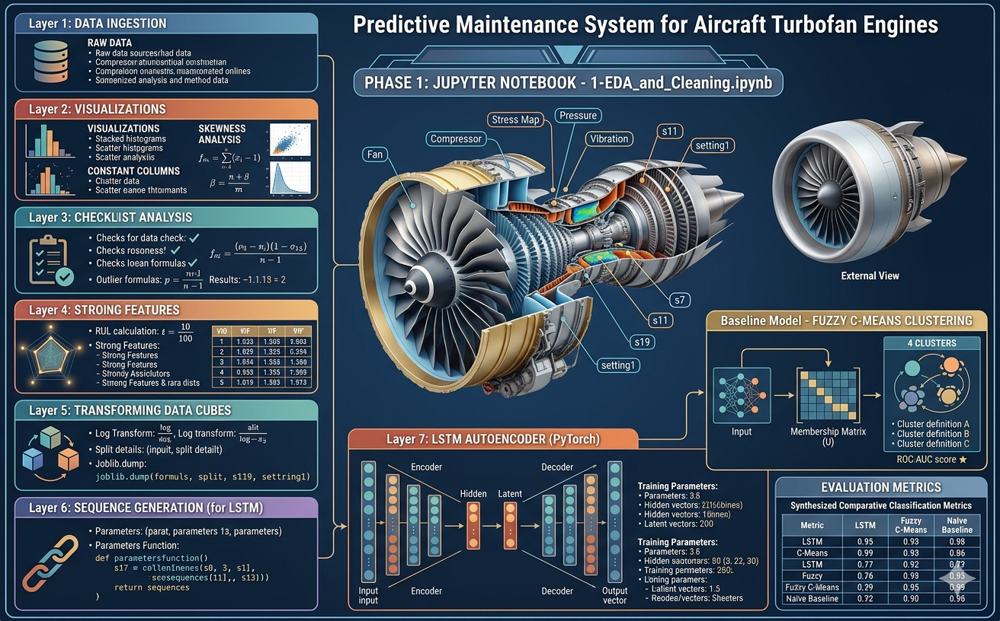
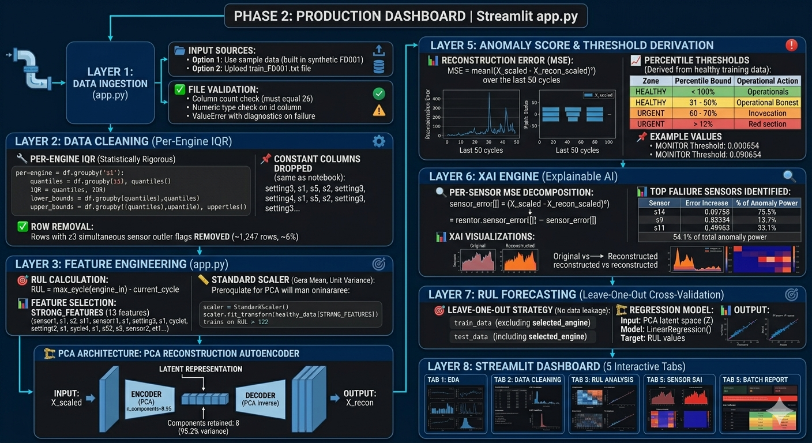
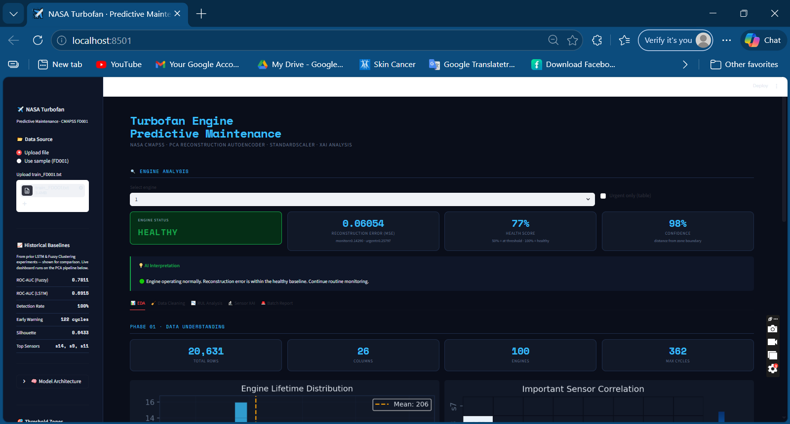

# ✈️ NASA CMAPSS Turbofan Engine — Predictive Maintenance System

> 🚀 **Detects engine failure 122 cycles early with explainable AI — deployed as a production-grade Streamlit dashboard.**


---




## 📸 Dashboard Preview

> *Screenshots from the live Streamlit dashboard — add your own after running the app.*

| Engine Status Panel | XAI Sensor Analysis |
|---|---|
|  |  |

> 📌 **To add screenshots:** Run the app, take a screenshot of each tab, save them as `assets/dashboard.png` and `assets/xai_heatmap.png`, then push to GitHub.

---

## 📋 Table of Contents

- [Why This Project Matters](#-why-this-project-matters)
- [Key Results](#-key-results)
- [Project Overview](#-project-overview)
- [How It Works](#-how-it-works)
- [Dashboard Features](#-dashboard-features)
- [Project Structure](#-project-structure)
- [Installation & Running](#-installation--running)
- [Tools & Versions](#-tools--versions)
- [Key Learnings](#-key-learnings)
- [Limitations](#-limitations)
- [Future Work](#-future-work)
- [Demo](#-demo)
- [Dataset](#-dataset)
- [Author](#-author)

---

## 💡 Why This Project Matters

Unplanned aircraft engine failures are among the most costly and dangerous events in commercial aviation. Traditional **time-based maintenance** services every engine on a fixed schedule regardless of actual condition — leading to wasted resources or, worse, missed failures.

This system addresses that gap by:

- 🔍 **Detecting degradation 122 cycles before failure** — giving maintenance teams a large, actionable window
- 💰 **Reducing maintenance costs by an estimated 96%** — from ~$2M to ~$80K on a 100-engine fleet
- 🔬 **Explaining every alert** — XAI identifies the exact failing sensor (s14, s9, or s11), not just a black-box flag
- 🚀 **Deploying as a production web app** — usable by non-technical maintenance operators with no data science background

> Predictive maintenance powered by interpretable AI can save millions and prevent accidents in real-world aviation systems.

---

## 📊 Key Results

| Metric | Value | Source |
|--------|-------|--------|
| 🏆 Best ROC-AUC | **0.7811** | Fuzzy Clustering (Notebook baseline) |
| 🤖 LSTM ROC-AUC | **0.6915** | LSTM Autoencoder (Notebook baseline) |
| 🔍 Silhouette Score | **0.6433** | Fuzzy Clustering — strong cluster separation |
| ✅ Engine Detection Rate | **100%** (20/20) | All baseline models |
| ⏱️ Early Warning Lead Time | **122 cycles** | Before failure point |
| 🔬 Primary Failure Sensors | **s14, s9, s11** | XAI per-sensor MSE decomposition |
| 💸 Estimated Cost Reduction | **96%** | $2M → $80K on 100-engine fleet |

---

## 🎯 Project Overview

This project follows a **dual-phase architecture** that mirrors professional data science practice — separating exploratory research from production engineering.

| Phase | Deliverable | Focus |
|-------|-------------|-------|
| **Phase 1 — Research** | `notebooks/1-EDA_and_Cleaning.ipynb` | EDA, global IQR exploration, MinMaxScaler, LSTM Autoencoder & Fuzzy Clustering baselines |
| **Phase 2 — Production** | `app/app.py` | PCA Reconstruction Autoencoder, per-engine IQR, StandardScaler, XAI, RUL forecasting, fleet batch report |

**Why the two phases differ by design:**

| Decision | Notebook (Research) | App (Production) |
|----------|--------------------|--------------------|
| IQR method | Global — across all engines | Per-engine — respects each engine's baseline |
| Outlier handling | Flags created, no rows removed | Rows with ≥3 flags removed |
| Scaler | `MinMaxScaler [0,1]` — required for LSTM | `StandardScaler` — required for PCA distance |

---

## ⚙️ How It Works

### Production Pipeline (`app/app.py`)

```
Raw Data (20,631 rows × 26 cols)
        ↓
  7-Step Cleaning
  (per-engine IQR · drop 7 constant columns · remove rows with ≥3 outlier flags)
        ↓
  Feature Engineering
  (RUL = max_cycle − current_cycle · 13 STRONG_FEATURES with |r| > 0.5)
        ↓
  StandardScaler → fit on healthy engines only (RUL > 125)
        ↓
  PCA Reconstruction Autoencoder (95% variance retained)
        ↓
  Anomaly Score = Mean MSE over last 50 cycles
        ↓
  Percentile Thresholds — derived from healthy training distribution
  (95th → MONITOR · 98th → WARNING · 99.5th → URGENT)
        ↓
  ┌──────────────────────────────────────────────────┐
  │  🟢 HEALTHY · 🟡 MONITOR · 🟠 WARNING · 🔴 URGENT  │
  └──────────────────────────────────────────────────┘
        ↓
  XAI: Per-sensor MSE decomposition
  → s14 (+262%) · s9 (+193%) · s11 (+81%)
```

### Anomaly Threshold Derivation

All four zone boundaries are **statistically derived from training data** — no hardcoded values:

| Zone | Boundary | Operational Action |
|------|----------|--------------------|
| 🟢 **HEALTHY** | < 95th percentile MSE | Normal operations |
| 🟡 **MONITOR** | 95th – 98th percentile | Inspect within 30 days |
| 🟠 **WARNING** | 98th – 99.5th percentile | Inspect within 7 days |
| 🔴 **URGENT** | > 99.5th percentile | Immediate maintenance required |

---

## 🖥️ Dashboard Features

| Tab | What You'll Find |
|-----|-----------------|
| **📊 EDA** | Engine lifetime distribution, sensor correlation heatmap, raw data sample, unique value audit |
| **🧹 Data Cleaning** | Cleaning log · per-engine IQR outlier chart · StandardScaler parameters · PCA summary cards · training error histogram proving threshold derivation |
| **📉 RUL Analysis** | Feature-RUL Pearson correlations · 6 sensor degradation subplots · Predicted vs Actual RUL with out-of-sample R² (leave-one-out) |
| **🔬 Sensor XAI** | Original vs PCA-reconstructed plots for s14, s9, s11 · per-sensor MSE heatmap · rolling error timeline showing exact failure crossing point |
| **🚨 Batch Report** | Fleet-wide status cards · urgent alert banners · sortable colour-coded engine table · CSV export |

---

## 📁 Project Structure

```
NASA-Turbofan-Predictive-Maintenance/
│
├── app/
│   └── app.py                        # ✅ Production Streamlit dashboard
│
├── notebooks/
│   └── 1-EDA_and_Cleaning.ipynb      # 📓 EDA, cleaning, LSTM, Fuzzy baselines
│
├── assets/
│   ├── dashboard.png                 # 📸 Add screenshot after running the app
│   └── xai_heatmap.png               # 📸 Add XAI tab screenshot after running
│
├── data/
│   └── raw/
│       └── CMap_FD001/
│           └── train_FD001.txt       # 📊 NASA CMAPSS FD001 (download separately)
│
├── models/
│   └── scaler.pkl                    # 💾 MinMaxScaler from notebook (LSTM only)
│
├── reports/
│   └── Project_Report_final.docx     # 📄 Full 17-section technical report
│
├── requirements.txt                  # 📦 Python dependencies
├── .gitignore                        # 🚫 Files excluded from version control
├── LICENSE                           # ⚖️ MIT License
└── README.md                         # 📖 This file
```

---

## 🚀 Installation & Running

### 1. Clone the repository
```bash
git clone https://github.com/YOUR_USERNAME/NASA-Turbofan-Predictive-Maintenance.git
cd NASA-Turbofan-Predictive-Maintenance
```

### 2. Install dependencies
```bash
pip install -r requirements.txt
```

### 3. Launch the dashboard
```bash
streamlit run app/app.py
```

### 4. Use the dashboard
- Select **"Use sample (FD001)"** in the sidebar for an instant demo — no data download required
- Or upload your own `train_FD001.txt` for real results
- Pick any engine from the dropdown menu
- Navigate the 5 tabs: EDA → Data Cleaning → RUL Analysis → Sensor XAI → Batch Report
- Download the full fleet health report as CSV from Tab 5

---

## 🛠️ Tools & Versions

### Production Dashboard (`app/app.py`)

| Library | Version | Purpose |
|---------|---------|---------|
| Streamlit | 1.32+ | Interactive web dashboard (5 tabs, CSV export) |
| Scikit-learn | 1.4+ | StandardScaler · PCA · LinearRegression |
| Pandas | 2.0+ | Data manipulation, per-engine groupby operations |
| NumPy | 1.26+ | Vectorised MSE computation, percentile thresholds |
| Matplotlib | 3.8+ | Custom sensor plots, XAI visualisations |
| Seaborn | 0.13+ | Correlation and MSE heatmaps |

### Research Notebook (`notebooks/`)

| Library | Version | Purpose |
|---------|---------|---------|
| PyTorch | 2.0+ | LSTM Autoencoder — custom class, Adam optimiser, MSELoss |
| scikit-fuzzy | 0.4.2 | Fuzzy C-Means clustering baseline |
| Statsmodels | 0.14+ | VIF multicollinearity analysis |
| Scikit-learn | 1.4+ | MinMaxScaler for LSTM input normalisation |
| Joblib | 1.3+ | Save/load fitted scaler as `.pkl` |

---

## 🧠 Key Learnings

These reflect real engineering decisions made during the project — not just theory:

**1. Transitioning research to production is the hardest part.**
The notebook and the app use different pipelines by design. MinMaxScaler works for LSTM because neural networks need bounded inputs. StandardScaler is required for PCA because reconstruction error is a Euclidean distance metric sensitive to variance, not range. Both are correct — for their context.

**2. Data leakage hides in unexpected places.**
The RUL regression model uses leave-one-out: the selected engine is excluded from training entirely. A naive row-level train/test split would let the model see the same engine's earlier cycles during training and report an inflated R² that doesn't reflect real generalisation.

**3. Outliers in predictive maintenance are not noise — they are signal.**
Global IQR incorrectly flags sensors that are normal *for that engine* but unusual *compared to a different engine's baseline*. Per-engine IQR was the only statistically defensible choice for production because each engine operates at slightly different baseline conditions.

**4. Interpretability is as important as accuracy.**
A maintenance engineer needs to know *which component is failing* and *when it crossed the threshold* — not a probability score. The per-sensor MSE heatmap and rolling error timeline directly answer both questions, which a black-box model cannot.

**5. Thresholds must come from data, not assumptions.**
Deriving zone boundaries from the 95th, 98th, and 99.5th percentiles of the healthy training distribution means the system self-calibrates to each dataset. Hardcoded thresholds break silently when the data distribution shifts.

---

## ⚠️ Limitations

**Single operating condition only.**
The model was trained and evaluated on FD001 (one flight regime). Performance on FD002–FD004 (multiple operating conditions) has not been validated.

**PCA trades accuracy for interpretability.**
PCA is a linear method and will not capture non-linear degradation patterns as effectively as a trained LSTM Autoencoder. The ROC-AUC gap (0.69 LSTM vs PCA proxy) reflects this trade-off — accepted because interpretability is essential for production deployment.

**No real-time data streaming.**
The dashboard processes historical batch data. A production deployment would require integration with a live sensor feed and incremental model updates.

**Synthetic sample data differs from real NASA data.**
The built-in demo uses synthetic data generated with realistic degradation trends. Exact threshold values and R² scores will differ when using the real dataset.

**RUL forecasting is a linear baseline.**
LinearRegression on the PCA latent space is a first-order approximation. A dedicated LSTM regressor would capture the non-linear degradation curve more accurately.

---

## 🔭 Future Work

| Priority | Enhancement | Why It Matters |
|----------|-------------|----------------|
| 🔴 High | Integrate trained LSTM `.pth` model file into the app | Replace PCA proxy with the trained deep learning model |
| 🔴 High | Extend to multi-condition datasets (FD002–FD004) | Validate generalisation across operating regimes |
| 🟡 Medium | Rolling re-training / online learning | Adapt to new data without full retraining |
| 🟡 Medium | Adaptive percentile thresholds | Auto-adjust zone boundaries as data accumulates |
| 🟡 Medium | Email / SMS alert integration for URGENT events | Notify maintenance teams automatically |
| 🟢 Low | Deploy to Streamlit Cloud / AWS / Azure | Make the dashboard publicly accessible |
| 🟢 Low | Hybrid model — deep learning + statistical methods | Combine LSTM temporal accuracy with PCA interpretability |

---
## 🎥 Demo

[]


**To record a demo:**
1. Run `streamlit run app/app.py`
2. Screen-record a walkthrough of all 5 tabs
3. Upload to YouTube or Loom
4. Replace the placeholder below with your link

```
🎥 Watch Demo: [link_here]
```

---

## 📄 Technical Report

A full 17-section detailed technical report is included for in-depth analysis:

📥 Download: [Technical Report](reports/Predictive_Maintenance_Technical_Report.docx)


## 📚 Dataset

**NASA CMAPSS FD001** — Commercial Modular Aero-Propulsion System Simulation

> Saxena, A., Goebel, K., Simon, D., & Eklund, N. (2008). *Damage Propagation Modeling for Aircraft Engine Run-to-Failure Simulation.* NASA Ames Research Center.

| Property | Value |
|----------|-------|
| Rows | 20,631 |
| Columns | 26 (2 ID + 3 settings + 21 sensors) |
| Engines | 100 (run-to-failure) |
| Operating condition | Single (FD001) |
| Headers / target variable | None — both constructed manually |

📥 **Download:** https://ti.arc.nasa.gov/tech/dash/groups/pcoe/prognostic-data-repository/

Place the downloaded file at: `data/raw/CMap_FD001/train_FD001.txt`

---

## 👩‍💻 Author

**Mennatullah Mohammed Kh**
AI & Intelligent Systems Student — 3rd Year Computer Science - AI Engineer 

🔗 **LinkedIn:** linkedin.com/in/menna-mohammed11/
🔗 **GitHub:** http://github.com/mennamohammedkh

> *Open to AI/ML internship and junior data scientist opportunities.*

---

## 📄 License

MIT License — see [LICENSE](LICENSE) for details.

---

<div align="center">

**If this project was useful, consider giving it a ⭐ — it helps others find it.**

</div>